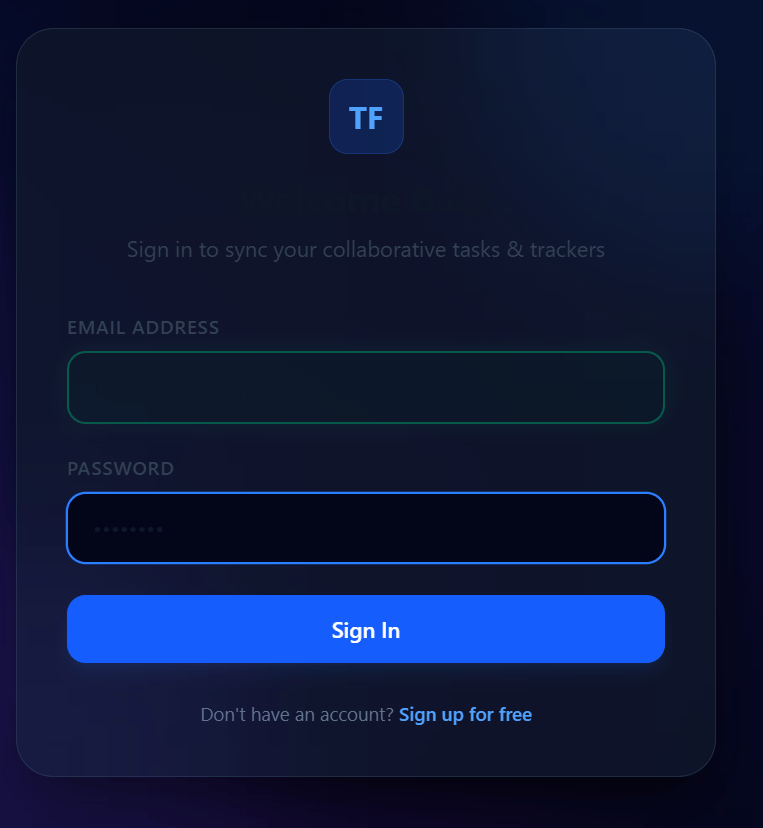
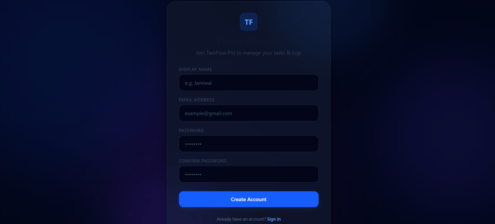
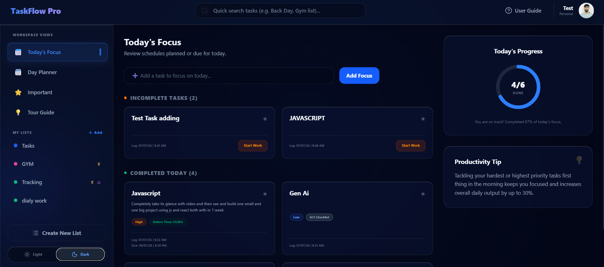
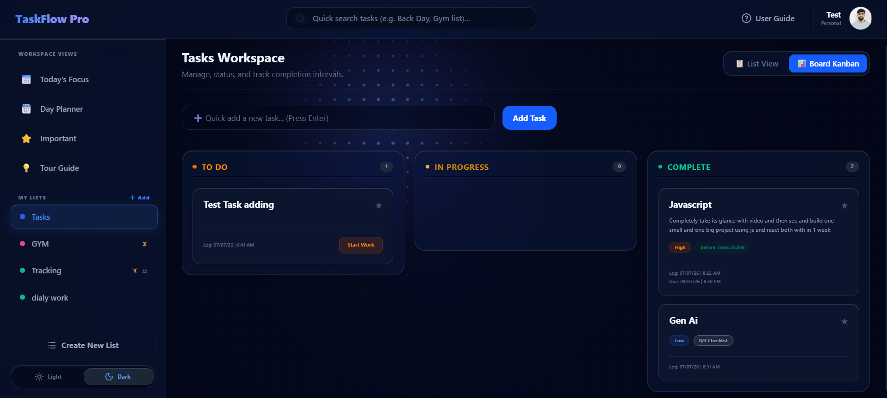
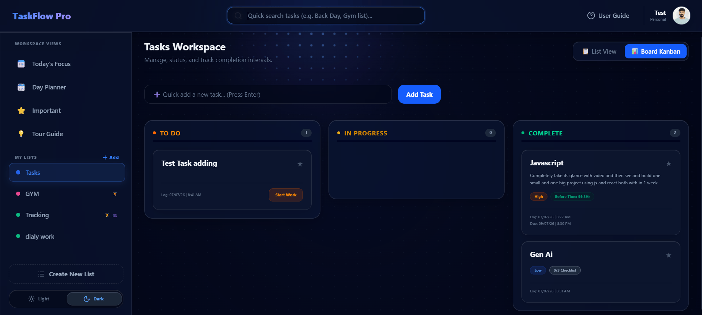

# TaskFlow Pro 🚀


TaskFlow Pro is a highly polished, full-stack productivity and task management application designed for both personal and business use. It features a stunning, state-of-the-art frosted glass UI (Glassmorphism), real-time data persistence, and interactive drag-and-drop Kanban boards.

Built with a focus on premium aesthetics and seamless user experience, TaskFlow Pro makes organizing your daily life and workflows not just efficient, but genuinely enjoyable.

---

## ✨ Key Features

- **🔒 Secure Authentication:** Fully custom JWT-based authentication system with real-time input validation, strong password enforcement, and a gorgeous animated neon-blob background.
- **📋 Smart Task Management:** Create, edit, and organize tasks across multiple custom lists. Easily mark tasks as important, set deadlines, and track your performance.
- **🖱️ Drag & Drop Kanban Board:** Visualize your workflow! Seamlessly drag tasks between "To Do", "In Progress", and "Complete" columns. The database updates your task status instantly.
- **🔍 Global Search:** A powerful, debounced global search command palette that lets you instantly find any task across all of your lists and navigate directly to it.
- **📊 Real-Time Analytics:** The Dashboard and "Today" views automatically calculate your daily progress with interactive, dynamically updating circular progress bars.
- **🎨 Premium UI/UX:** Built with Tailwind CSS, featuring subtle micro-animations, customized scrollbars, dynamic gradients, and a frosted glass design system that feels incredibly modern and responsive.

---

## 📸 Screenshots

*(Replace the image paths below with the actual screenshots before pushing to GitHub)*

### 1. Authentication Interface

<p align="center">
  
  <br /><br />
  
</p>
> *The login and registration flow featuring real-time password strength validation, regex email checking, and the signature animated floating neon blobs in the background.*

### 2. Dashboard & Today's Progress

> *The main dashboard summarizing your day. Features a mathematical SVG circular progress indicator that perfectly tracks your daily task completion rate.*

### 3. Interactive Kanban Board

> *The list view configured as a Kanban Board. Users can click and drag tasks effortlessly between status columns, triggering real-time database updates.*

### 4. Global Search Palette

> *The debounced global search dropdown in the Navbar, allowing users to instantly locate tasks across their entire workspace.*

---

## 🛠️ Technology Stack

**Frontend (Client)**
- React 18 (TypeScript)
- Vite (Build Tool)
- Tailwind CSS (Styling & Animations)
- Lucide React (Icons)
- Axios (API Client)
- React Router DOM (Routing)

**Backend (API)**
- .NET 10 (C# ASP.NET Core Web API)
- Entity Framework Core
- Microsoft SQL Server (MSI\SQLEXPRESS)
- JWT Bearer Authentication

---

## 🚀 Installation & Setup

Before starting, ensure you have **Node.js**, **.NET SDK**, and **SQL Server** installed on your machine.

### 1. Clone the Repository
```bash
git clone https://github.com/yourusername/taskflow-pro.git
cd taskflow-pro
```

### 2. Backend Setup (.NET API)
1. Navigate to the API directory:
   ```bash
   cd TaskFlowPro.API
   ```
2. Update the `appsettings.json` file with your local SQL Server connection string. (Ensure `appsettings.Development.json` is not committed).
3. Apply the Entity Framework database migrations:
   ```bash
   dotnet ef database update
   ```
4. Run the API Server:
   ```bash
   dotnet run
   ```
   *The server will start on `http://localhost:5100`. You can access the Swagger UI at `/swagger`.*

### 3. Frontend Setup (React/Vite)
1. Open a new terminal and navigate to the client directory:
   ```bash
   cd taskflow-client
   ```
2. Install the Node dependencies:
   ```bash
   npm install
   ```
3. Start the development server:
   ```bash
   npm run dev
   ```
   *The frontend will be available at `http://localhost:5173`.*

---

## 🔮 Future Scope

While TaskFlow Pro is fully operational, development is continuous! Here are the features currently planned for the roadmap to show that this project is actively evolving:

- [ ] **Collaborative Lists:** Invite other users to your lists via email to collaborate on projects, assign tasks to specific team members, and chat in real-time.
- [ ] **Workout / Fitness Integrations:** A dedicated module for tracking gym routines, exercise templates, and workout logs directly within the TaskFlow ecosystem.
- [ ] **Push Notifications:** Web-based push notifications to remind users of impending task deadlines and daily check-ins.
- [ ] **Dark/Light Theme Toggle:** Adding user preference toggles to seamlessly switch the entire Glassmorphism design system between dark and light modes.
- [ ] **Task Attachments:** Allow users to upload and attach images or PDFs directly to specific tasks.

---

> **Note on Security:** All sensitive files, including `.env`, `appsettings.Development.json`, and database connection strings, have been strictly excluded via `.gitignore` to ensure safe deployment and repository sharing.

---

<div align="center">
  <i>made with lots of love ❤️ by <b style="text-shadow: 0 0 10px #a78bfa, 0 0 20px #a78bfa; color: #a78bfa;">✨ Jamiwal-3704 ✨</b></i>
</div>
