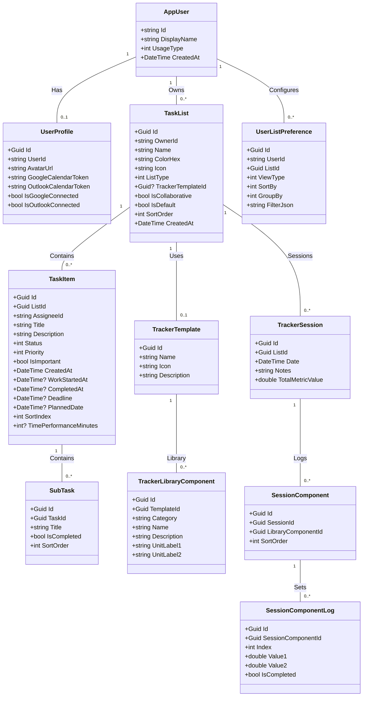

# Implementation Plan - TaskFlow Pro

TaskFlow Pro is a real-time, collaborative task management application built using a full-stack architecture with **ASP.NET Core 8 Web API** on the backend and **React 18 (TypeScript) + Tailwind CSS** on the frontend, using **SQL Server** as the local database and **SignalR** for real-time collaboration.

---

## User Review Required

We need to align on some tech stack choices before starting:
> [!IMPORTANT]
> **1. Styling Framework:** The developer guide mentions Tailwind CSS, but we should confirm if you prefer Tailwind CSS (and if so, whether we should use **Tailwind v3** or the newer **Tailwind v4**), or if you prefer **Vanilla CSS** with CSS Modules.
> 
> **2. Local Database:** The guide assumes SQL Server Express (`localhost\\SQLEXPRESS`). We can use local SQL Server or PostgreSQL/SQLite for local development. Let us know if you have a running SQL Server Express instance or if you want us to set up an alternative.

---

## Proposed Database Models

### Core Entities



---

## Recommended Project Folder Structure

### Backend (TaskFlowPro.API)
```
TaskFlowPro.API/
├── Controllers/
│   ├── AuthController.cs        # User signup, login, session restoring
│   ├── ListsController.cs       # Custom & collaborative lists (CRUD, reordering)
│   ├── TasksController.cs       # Tasks management (CRUD, status, priority, time performance)
│   ├── TrackerController.cs     # Tracker templates, sessions, components, and logs API
│   └── SubTasksController.cs    # Subtasks check-list endpoints
├── Data/
│   └── AppDbContext.cs          # EF Core context and DB configuration
├── DTOs/
│   ├── AuthDtos.cs              # Register, Login, Token response DTOs
│   ├── ListDtos.cs              # List request/response payloads
│   ├── TaskDtos.cs              # Task and SubTask request/response payloads
│   └── TrackerDtos.cs           # Tracker templates, logging DTOs
├── Hubs/
│   └── CollaborationHub.cs      # SignalR hub for real-time list synchronization
├── Models/
│   ├── AppUser.cs               # Identity User model
│   ├── UserProfile.cs           # Expanded user profile details (avatars, calendar tokens)
│   ├── TaskList.cs              # Todo / Tracker list grouping
│   ├── TaskItem.cs              # Individual task details
│   ├── SubTask.cs               # Checklist items under a task
│   ├── TrackerTemplate.cs       # Templates (e.g. Gym Workout, Running, Study Tracker)
│   ├── TrackerLibraryComponent.cs# Predefined loggable library items (e.g. Lat Pulldown, Bench Press)
│   ├── TrackerSession.cs        # Date-bound tracker sessions for history logging
│   ├── SessionComponent.cs      # Specific library component added to a daily session
│   ├── SessionComponentLog.cs   # Data rows tracking sets (Val1=Weight/Count, Val2=Reps/Minutes)
│   └── UserListPreference.cs    # UI View states per user/list
├── Program.cs                   # Web application builder, middleware pipeline, service configuration
├── appsettings.json             # Db connection strings and JWT credentials
└── TaskFlowPro.API.csproj
```

### Frontend (taskflow-client)
```
taskflow-client/
├── public/
├── src/
│   ├── api/
│   │   ├── axios.ts             # Axios client with interceptors for JWT
│   │   └── endpoints.ts         # Endpoint routing constants
│   ├── components/
│   │   ├── layout/
│   │   │   ├── Navbar.tsx       # Search bar, user profile, settings
│   │   │   ├── Sidebar.tsx      # Default views and user lists menu
│   │   │   └── DisplayPanel.tsx # Sliding panel for View/Sort/Filter settings
│   │   ├── tasks/
│   │   │   ├── TaskCard.tsx     # Task view card with state borders & time performance
│   │   │   ├── TaskModal.tsx    # Expanded modal (Subtasks list, deadlines, notes)
│   │   │   └── SubtaskItem.tsx  # Interactive subtask list row
│   │   ├── lists/
│   │   │   ├── ListItem.tsx     # Sidebar list item with controls
│   │   │   └── NewListModal.tsx # Dialog to create a custom/collaborative list
│   │   ├── tracker/
│   │   │   ├── ComponentLibrary.tsx # Left side catalog layout (categorized exercise cards)
│   │   │   ├── TodayWorkout.tsx # Right side workspace for active day logged items
│   │   │   ├── ExerciseCard.tsx # Detailed card rendering name, volume, and sets
│   │   │   ├── SetRow.tsx       # Set row with weight, reps, completed toggle (+/- controls)
│   │   │   ├── VolumeCalculator.tsx # Bottom / header total volume calculator
│   │   │   └── SessionHistory.tsx # Calendar history read-only session viewer
│   │   ├── calendar/
│   │   │   ├── WeekStrip.tsx    # Horizontal calendar week navigation bar
│   │   │   └── DayColumn.tsx    # Drag-and-drop column for day-wise view
│   │   └── common/
│   │       ├── Avatar.tsx       # Live-letter generated or image avatar
│   │       ├── Badge.tsx        # Styled tags (Priority, Status, Time performance)
│   │       ├── Button.tsx       # UI button elements
│   │       └── Modal.tsx        # Generic popup dialog modal
│   ├── context/
│   │   ├── AuthContext.tsx      # User authentication states
│   │   └── TaskContext.tsx      # Shared state for current list context
│   ├── hooks/
│   │   ├── useSignalR.ts        # WebSocket listener for collaboration
│   │   ├── useTasks.ts          # Encapsulated state management for task CRUD
│   │   ├── useTracker.ts        # Log hooks (fetch templates, library items, daily session logs)
│   │   └── usePreferences.ts    # Preferences fetching and saving
│   ├── pages/
│   │   ├── Auth/
│   │   │   ├── Login.tsx        # Sign-in form
│   │   │   └── Register.tsx     # Registration form
│   │   ├── Onboarding/
│   │   │   ├── OnboardingWizard.tsx # Container for steps
│   │   │   ├── Step1.tsx        # Welcome & Feature showcase
│   │   │   ├── Step2.tsx        # Name & live avatar builder
│   │   │   ├── Step3.tsx        # Usage type selection
│   │   │   └── Step4.tsx        # Calendar integrations
│   │   ├── Dashboard/
│   │   │   └── DashboardLayout.tsx # Main dashboard frame (Sidebar, Navbar, Main area)
│   │   ├── Today/
│   │   │   └── TodayView.tsx    # Today's pending and completed tasks
│   │   ├── DayWise/
│   │   │   └── DayWiseView.tsx  # Dynamic week strip calendar planner
│   │   ├── Important/
│   │   │   └── ImportantView.tsx # Starred items across all lists
│   │   └── List/
│   │       ├── ListPage.tsx     # Standard list views (List/Board views)
│   │       └── TrackerListPage.tsx # Dynamic layout for tracking lists (e.g. Gym Workout logs)
│   ├── types/
│   │   ├── task.ts
│   │   ├── list.ts
│   │   ├── tracker.ts           # Interfaces for Tracker templates, session logs, sets
│   │   └── user.ts
│   ├── App.tsx                  # React Router routes definition
│   ├── main.tsx                 # App mount entry point
│   └── index.css                # Base styling configuration
├── tailwind.config.js
├── postcss.config.js
├── tsconfig.json
├── vite.config.ts
└── package.json
```

---

## Suggested Development Order (Feature First, Then Production Ready)

We recommend dividing the work into 4 clear phases:

### Phase 1: Local Foundation & Project Setup
1. **Initialize the workspace structure:** Create directories, initialize dotnet webapi and vite react templates.
2. **Setup models & Database:** Create Entity Framework configurations and run migrations.
3. **Write Mock DTOs & Seed Data:** Create endpoints returning mock data so we can immediately start the frontend.

### Phase 2: Frontend Layout & Auth Integration
1. **Authentication:** Build registration, login, and token storage.
2. **Onboarding Wizard:** Implement step-by-step layout flow.
3. **Core Dashboard Structure:** Responsive sidebar and navigation shell.

### Phase 3: Core Features Build
1. **List & Task Management:** Task creation, board/list layouts, and list creation.
2. **Time Tracking Logic:** Implement task start/stop and "Time performance" badge computations.
3. **Planner & Views:** Today view, Day-wise week strip planner, and Date-wise view.
4. **Collaboration:** Integrate SignalR hub for real-time list sync across users.
5. **Generic Tracker Logging (Gym, etc.):** Set up Db tracker tables/seed scripts, build Tracker API endpoints, write library and session card frontends with increment/decrement state counters and total volume calculations.

### Phase 4: Production Ready Optimization
1. **Security & Validation:** JWT middleware hardening, request validators, HTTPS configuration.
2. **Robust Error Handling:** Global exception handling middleware, error loggers, user-friendly frontend alerts.
3. **Drag & Drop UI Polishing:** Integrate `@dnd-kit` for kanban board column reordering, exercise library drags, and calendar dragging.
4. **Deployment Preparation:** Configure Dockerfiles or multi-environment appsettings, setup Neon.tech integration.

---

## Verification Plan

### Automated Verification
- We will configure unit test projects `TaskFlowPro.Tests` on the backend to test controllers and time tracking logic.
- We will run lint checks (`eslint`, `dotnet build`) to verify syntax compliance.

### Manual Verification
- We will open mock accounts in two separate browser sessions to test collaborative sync via SignalR.
- We will change system deadlines to verify that the time performance metrics compute "Before Time" and "Time Exceed" properly.
